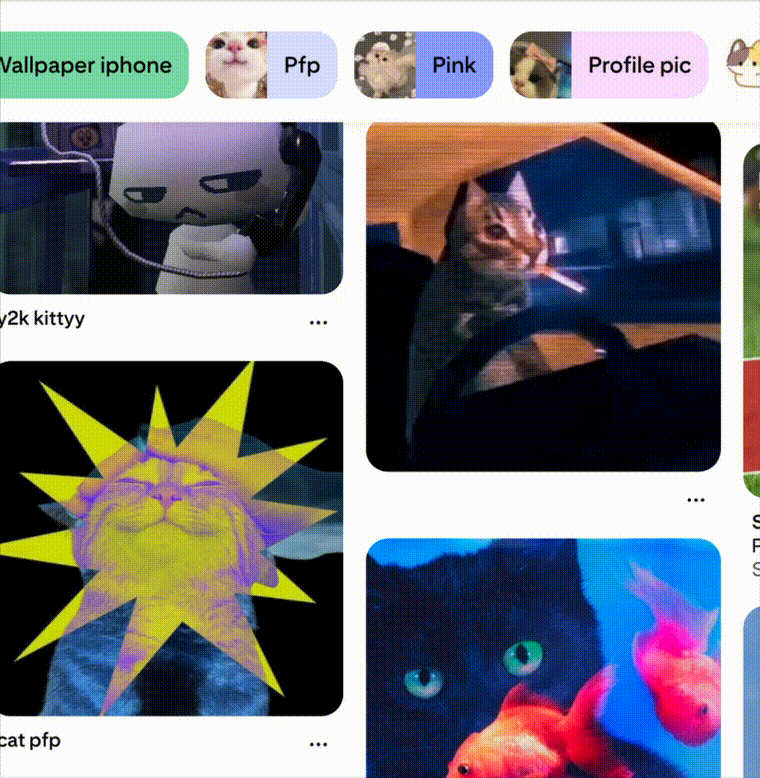

<div align="center">


# Pluck

*Hover a pin. Pluck the image. Paste it anywhere.*




**No account · No server · No analytics**

</div>

---

Copy a Pinterest feed image straight to your clipboard without ever opening the Pin. Hover a still image, click **Copy**, and paste a clean PNG into Messages, Slack, Figma, ChatGPT, or anything else that reads images from the clipboard.

> **v0.8.0** · Safari on macOS is the proven target. The same source also builds Chromium and Firefox packages; those still need live browser testing before I would call them supported.

## Before and after

Pluck removes the Pin-page detour. You stay in the feed, copy the visible image, and paste it wherever you were already working.

```text
Without Pluck   Feed ──▶ Open Pin ──▶ Copy / save ──▶ Back ──▶ Repeat ↺
With Pluck      Feed ──▶ Hover image ──▶ Copy ──▶ Paste ✓
```

## What works today

- A small **Copy** button on still images in the home feed, search results, and boards
- Carousel pins copy the slide that is actually visible
- Video pins are skipped
- A clean PNG on the system clipboard
- Optional higher-res fetch from `i.pinimg.com` when the page exposes a larger URL, off by default
- A layered fallback: loaded `` first, then a cropped visible-tab screenshot if canvas extraction is blocked
- The screenshot path strips Pinterest hover UI (Save button, dark scrim, **Last visited** chip) before capture
- Diagnostics mode to see which stage of the pipeline succeeded or failed

## What it avoids on purpose

Pinterest's feed is a constantly mutating masonry grid. Pluck deliberately does **not**:

- observe the whole document subtree,
- rescan the page on a timer,
- prefetch images before you click Copy,
- read the clipboard,
- talk to a backend.

Pointer movement only stores coordinates. Image detection runs when the pointer enters a new element. The overlay hides while you scroll and does one debounced check after scrolling settles.

## How a copy works

Safari rejects `navigator.clipboard.write()` unless it is tied to the original physical click. So the extension opens the clipboard write **synchronously** inside a MAIN-world bridge, then resolves the PNG bytes afterward. Each stage below is a fallback for the one before it.

```text
1. Click Copy
       │
2. Start clipboard write   (synchronous, tied to the physical click)
       │
3. CDN fetch (if enabled) ──── clean ────▶ Clipboard gets PNG
       │                                        ▲
   off / failed                                 │
       │                                        │
4. Loaded image → canvas ──── clean ────────────┤
       │                                        │
    blocked                                     │
       │                                        │
5. Clean screenshot crop ───────────────────────┘
```

Reading the diagram:

- **CDN fetch** is optional and highest quality, but only for a validated `i.pinimg.com` URL.
- **Loaded image** is the normal local path from the image already on the page.
- **Clean screenshot** is the last resort after Pluck and Pinterest hover UI are hidden.

The reliability code looks heavier than the happy path deserves because every one of these stages broke in Safari at least once. Read [`docs/ENGINEERING_HISTORY.md`](docs/ENGINEERING_HISTORY.md) before "simplifying" anything.

## Architecture at a glance

```text
Pinterest DOM ──visible image──▶ content.js          ──PNG bytes──▶ page-clipboard.js
      ▲                          (detect + overlay)                 (trusted click)
      │                              ▲    │                               │
      │ visible-tab capture          │    │ validated messages     clipboard write
      │                              │    ▼                               ▼
 background.js ◀────────────────────────┘                            [ Clipboard ]
 (fetch + capture) ──optional fetch──▶ [ i.pinimg.com ]

 popup.js (toggles) ──▶ [ local settings ] ──▶ content.js
```

Full detail on worlds, messages, and security boundaries lives in [`docs/ARCHITECTURE.md`](docs/ARCHITECTURE.md).

## Repository layout

```text
extension/            WebExtension source, shared across browsers
  manifest.json       Safari-first MV3
  content.js          detection, overlay, copy pipeline
  page-clipboard.js   MAIN-world clipboard bridge
  background.js       fetch, tab capture, bridge injection
  shared.js           URL validation, srcset ranking
  popup.html / popup.js   settings and optional CDN permission
tests/                Node regression tests
scripts/              validate, build, package, Safari wrapper
docs/                 architecture, porting, CI, debugging
.github/workflows/    CI on push and PR; release on version tags
```

File-by-file detail: [`docs/CODEBASE_DEEP_DIVE.md`](docs/CODEBASE_DEEP_DIVE.md).

## Install

Store listings roll out per [`docs/STORE_PUBLISHING.md`](docs/STORE_PUBLISHING.md). Until a given store is live, every browser can install straight from the [GitHub Releases](../../releases) ZIPs, which are rebuilt on every tagged version.

| Browser | Package | Load it |
|---|---|---|
| Chrome, Brave, Opera | `pluck-chromium-<version>.zip` | Unzip, open `chrome://extensions`, enable **Developer mode**, choose **Load unpacked**, select the unzipped folder |
| Edge | `pluck-chromium-<version>.zip` | Same as Chrome, via `edge://extensions` |
| Firefox | `pluck-firefox-<version>.zip` | Unzip, open `about:debugging#/runtime/this-firefox`, choose **Load Temporary Add-on**, select `manifest.json` (temporary until the AMO listing is live) |
| Safari | `pluck-safari-<version>.zip` | Unzip, then follow [`docs/SAFARI_INSTALLATION.md`](docs/SAFARI_INSTALLATION.md), which needs Xcode |

## Safari setup (macOS)

You need macOS, Safari, Xcode, and Node 20 or newer.

```bash
npm run ci
chmod +x scripts/package-safari.sh
BUNDLE_ID="com.yourname.pluck.dev" ./scripts/package-safari.sh
```

Then in Xcode: sign both targets for local development, select **My Mac**, press **Cmd R**. Enable the extension under **Safari > Settings > Extensions**, allow Pinterest access, and reload Pinterest.

Step by step: [`docs/SAFARI_INSTALLATION.md`](docs/SAFARI_INSTALLATION.md).

## Developer commands

```bash
npm test             # unit and regression tests
npm run validate     # manifest, permissions, syntax, required docs
npm run build        # dist/safari, dist/chromium, dist/firefox
npm run package:all  # ZIPs under releases/
npm run ci           # validate + test + build (same as CI)
npm run clean        # remove dist/ and releases/
```

## Other browsers

One codebase, three generated packages. Do not fork six separate apps.

| Browser | Load from | Notes |
|---|---|---|
| Safari | `dist/safari` plus the Xcode wrapper | proven target |
| Chrome, Edge, Brave | `dist/chromium` | same package, separate store listings |
| Firefox | `dist/firefox` | different background manifest, needs signing |

Suggested rollout order: Safari, then Chrome, then Edge and Brave, then Firefox, then Opera. Porting checklist and test matrix: [`docs/BROWSER_PORTING.md`](docs/BROWSER_PORTING.md).

## Privacy and security

Pluck only touches Pinterest domains, plus optional `i.pinimg.com` for higher-quality mode. The background worker accepts exactly one validated image URL per fetch message: no general proxy, no `<all_urls>`, no credentials on fetch, no clipboard read. Persistent settings are local booleans (enabled, diagnostics, higher-quality) and nothing is uploaded.

- [`PRIVACY.md`](PRIVACY.md)
- [`SECURITY.md`](SECURITY.md)

## Documentation

| Doc | What it covers |
|---|---|
| [ARCHITECTURE.md](docs/ARCHITECTURE.md) | worlds, messages, state, security boundaries |
| [CODEBASE_DEEP_DIVE.md](docs/CODEBASE_DEEP_DIVE.md) | every file, safe-change rules |
| [BROWSER_PORTING.md](docs/BROWSER_PORTING.md) | Chrome, Edge, Brave, Opera, Firefox |
| [SAFARI_INSTALLATION.md](docs/SAFARI_INSTALLATION.md) | local Xcode workflow |
| [DEBUGGING.md](docs/DEBUGGING.md) | tracing a failed copy |
| [PERFORMANCE.md](docs/PERFORMANCE.md) | scroll and detection model |
| [RELEASE_CHECKLIST.md](docs/RELEASE_CHECKLIST.md) | pre-ship manual matrix |
| [STORE_PUBLISHING.md](docs/STORE_PUBLISHING.md) | one-time store setup, then automated releases |
| [ENGINEERING_HISTORY.md](docs/ENGINEERING_HISTORY.md) | v0.1 to v0.8 breakage log |
| [STORE_ASSETS.md](docs/STORE_ASSETS.md) | icons and listing assets |

## Known limits

- The screenshot fallback only captures the visible portion of a partially off-screen pin.
- The screenshot path is more fragile to Pinterest UI changes than direct byte extraction.
- A dirty clipboard image is worse than a clean failure. If an overlay cannot be removed, the extension fails rather than pasting junk.

## Contributing

[`CONTRIBUTING.md`](CONTRIBUTING.md). Keep changes narrow, preserve the trusted-click sequence, and add a regression test for every reproduced bug.

## License

No public license yet. Pick one deliberately before making the repo public.
